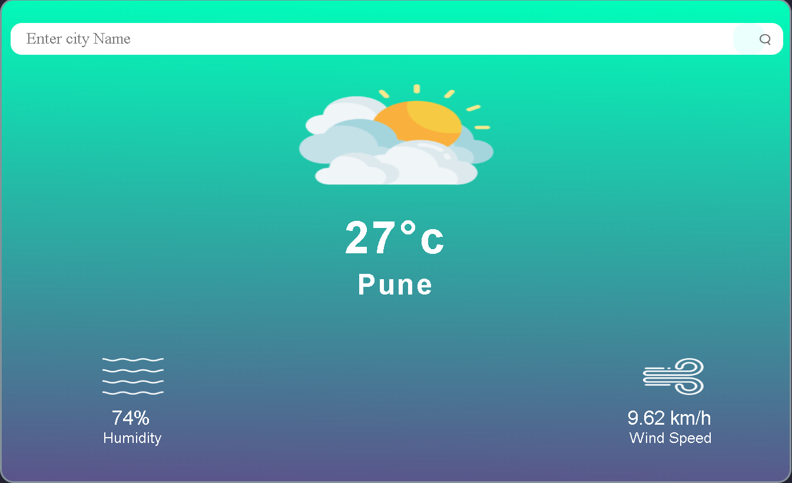

# Weather Studio 🌤️

Weather Studio is a simple and interactive React-based weather application that allows users to check the current **temperature**, **humidity**, and **wind speed** of any city using the [OpenWeatherMap API](https://openweathermap.org/api).  

It’s perfect for learning how to build a React app with API integration.

---

## 🚀 Features

- Enter a city name and get real-time weather information.
- Displays:
  - Temperature (°C)
  - Humidity (%)
  - Wind speed (m/s)
- Responsive and clean user interface.
- Built with **React** and **Axios**.

---

## 🎨 Demo

  
*Replace this with a screenshot of your app.*

---

## 🛠️ Installation & Setup

Follow these steps to run the project locally:

### 1. Clone the repository

```bash
git clone https://github.com/your-username/weather-studio.git


: Using VS Code Live Server

Open the folder in VS Code.

Install the Live Server extension (search in Extensions sidebar → Install).

Open index.html → Right-click → “Open with Live Server”.

Your browser will open at something like http://127.0.0.1:5500.